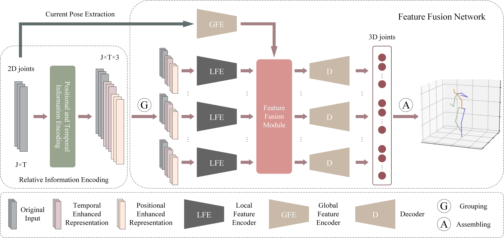

[](https://paperswithcode.com/sota/monocular-3d-human-pose-estimation-on-human3?p=improving-robustness-and-accuracy-via)
[](https://paperswithcode.com/sota/3d-human-pose-estimation-on-human36m?p=improving-robustness-and-accuracy-via)

# Improving Robustness and Accuracy via Relative Information Encoding in 3D Human Pose Estimation (ACM MM2021)
<p align="center"></p>
This is the implementation of the framework described in our paper: <a href="https://arxiv.org/abs/2107.13994"><i>Improving Robustness and Accuracy via Relative Information Encoding in 3D Human Pose Estimation</i></a> by Wenkang Shan, Haopeng Lu, Shanshe Wang, Xinfeng Zhang,  and Wen Gao.
<p align="center"></p>


# Quick start

### Dependencies

Make sure you have the following dependencies installed:

* PyTorch >= 0.4.0
* NumPy
* Matplotlib=3.1.0
* FFmpeg (if you want to export MP4 videos)
* ImageMagick (if you want to export GIFs)

### Dataset

Our model is evaluated on [Human3.6M](http://vision.imar.ro/human3.6m) and [HumanEva-I](http://humaneva.is.tue.mpg.de/datasets_human_1) datasets. We set up the Human3.6M dataset in the same way as [VideoPose3D](https://github.com/facebookresearch/VideoPose3D/blob/master/DATASETS.md).  You can download the processed data from [here](https://drive.google.com/file/d/1FMgAf_I04GlweHMfgUKzB0CMwglxuwPe/view?usp=sharing).  `data_2d_h36m_gt.npz` is the ground truth of 2D keypoints. `data_2d_h36m_cpn_ft_h36m_dbb.npz` is the 2D keypoints obatined by [CPN](https://github.com/GengDavid/pytorch-cpn).  `data_3d_h36m.npz` is the ground truth of 3D human joints. Put them in the `./data` directory.


### Evaluating our pretrained models
You can download our pretrained models from [here](https://drive.google.com/file/d/11CZffQzqfs5oK-xb2lJQL0G30K2ac10_/view?usp=sharing). Put `cpn_pretrained.bin` and `gt_pretrained.bin` in the `./checkpoint` directory. Both of the models are trained on Human3.6M dataset.

To evaluate the model trained on the ground truth of 2D keypoints, run:
```bash
python run.py -k gt --evaluate gt_pretrained.bin --stage 3 -lfd 256 
```
`-lfd` stands for "**l**atent **f**eature **d**imension". It controls the dimension of the latent features (including local features, global features, and fused features).

To evaluate the model trained on the 2D keypoints obtained by CPN, run:
```bash
python run.py -k cpn_ft_h36m_dbb --evaluate cpn_pretrained.bin --stage 3 -lfd 512 
```
It is more difficult to estimate 3D poses from the 2D keypoint detector (such as CPN). Therefore, we use more parameters in `cpn_pretrained.bin` than in `gt_pretrained.bin`. We set the dimension of the latent features to 512.


### Training from scratch

To train a model using the proposed multi-stage optimization method, you can run the following commands step by step.

For the first stage, run:

```bash
python run.py -k gt --stage 1 -lfd 256 
```
This will train the encoders for 80 epochs.  In this stage, the Feature Fusion Module (FFM) does not participate in the optimization process.

For the second stage, run:
```bash
python run.py -k gt --stage 2 -lfd 256 -p stage_1_epoch_80.bin
```
This will train the FFM for 80 epochs. The parameters of the encoders are loaded from the first stage and fixed.

For the third stage, run:
```bash
python run.py -k gt --stage 3 -lfd 256 -ft stage_2_epoch_80.bin -lr 0.0005 -e 20
```
This will finetune the whole framework for 20 epochs.


### Visualization 

To generate visualizations of the model, run:
```bash
-k gt --evaluate gt_pretrained.bin --stage 3 -lfd 256 --render --viz-subject S11 --viz-action WalkDog --viz-camera 1 --viz-video "./s_11_act_15_subact_02_ca_02.mp4" --viz-output output.gif --viz-size 3 --viz-downsample 2 --viz-limit 300
```
You can get different results by changing the values of these arguments.

### Citation
If you find this repo useful, please consider cite our paper:
```
@article{shan2021improving,
  title={Improving Robustness and Accuracy via Relative Information Encoding in 3D Human Pose Estimation},
  author={Shan, Wenkang and Lu, Haopeng and Wang, Shanshe and Zhang, Xinfeng and Gao, Wen},
  journal={arXiv preprint arXiv:2107.13994},
  year={2021}
}
```

# Acknowledgement
Our code refers to the following repositories.
* [3d-pose-baseline](https://github.com/una-dinosauria/3d-pose-baseline)
* [VideoPose3D](https://github.com/facebookresearch/VideoPose3D)
* [Attention3DHumanPose](https://github.com/lrxjason/Attention3DHumanPose)

We thank the authors for releasing their codes. If you use our code, please consider citing their works as well.